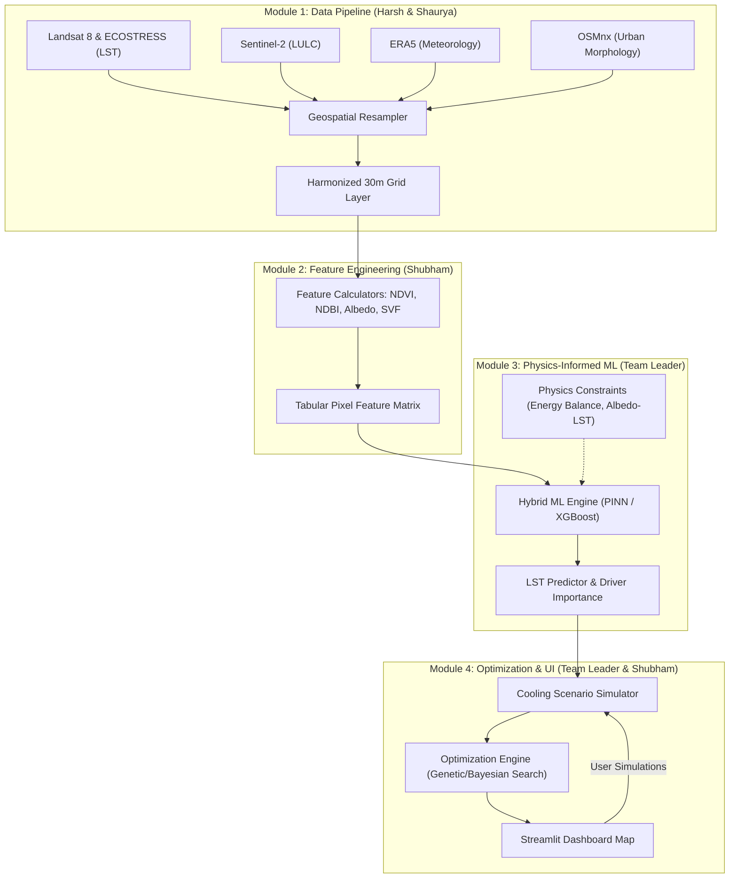

# AeroCool-AI: System Architecture

This document defines the system architecture, data pipeline, modeling mechanics, and optimization workflows for **AeroCool-AI**.

---

## Overall Data & Control Flow

AeroCool-AI operates as a sequential pipeline with feedback loops for optimization and simulation:



---

## Technology Stack

Our architecture leverages modern, industry-standard libraries tailored for high-performance geospatial analysis, physics-informed machine learning, and spatial optimization:

### 1. Data Engineering & Geospatial Processing

* **Rasterio & GDAL:** High-performance extraction, projection, and warping of multi-band Landsat 8 and ECOSTRESS GeoTIFF datasets.
* **GeoPandas & Fiona:** Tabular vector operations, spatial joins, and shapefile transformations.
* **xarray & NetCDF4:** Handling multidimensional ERA5 weather grids (temperature, wind vectors, humidity) over space and time.
* **OSMnx & NetworkX:** Structural analysis of street grids and building footprints pulled from OpenStreetMap.
* **Shapely & PyProj:** Low-level geometric calculations and geodetic coordinate conversions.

### 2. Analytical & Feature Engineering Compute

* **NumPy & Pandas:** Data processing, tabular pixel feature matrix management, and fast vectorized operations.
* **SciPy & Scikit-Image:** Morphological filtering, spatial kernel convolution, and sky view factor (SVF) structural modeling.

### 3. Machine Learning & Physical Modeling (Module 3)

* **PyTorch:** Framework for building the Physics-Informed Neural Network (PINN), using automatic differentiation to compute derivative-based physical constraints.
* **XGBoost:** Gradient-boosted decision trees for baseline LST modeling and robust feature importance calculations.
* **Scikit-Learn:** Data preprocessing pipelines (standardizers, encoders), baseline linear/tree regressors, and cross-validation splitting.

### 4. Optimization Engine (Module 4)

* **Optuna:** Bayesian optimization for search-space hyperparameter and intervention parameter tuning.
* **SciPy Optimize:** Classical numerical solvers (e.g., Sequential Least Squares Programming - SLSQP) for continuous optimization of variables (e.g., adjusting albedo scaling).

### 5. Interactive UI & Presentation Layer

* **Streamlit:** Single-page dashboard web app for scenario simulation and real-time execution.
* **Pydeck & Folium:** WebGL-accelerated 3D spatial mapping and leaflet maps to visualize resampled temperature layers and suggested greening zones.

### 6. Tooling & Development Lifecycle

* **uv:** High-speed dependency management and environment orchestration.
* **Pytest:** Testing suite for geospatial constraints and model validation checks.
* **Ruff:** Next-generation fast Python linter and code formatter.

---

## Architectural Modules Deep Dive

### 1. Module 1: Data Pipeline & Geospatial Ingestion

* **Location:** [data_pipeline/](file:///C:/Users/mayan/Coding/Hackathons/Cosmic-Tensors/data_pipeline)
* **Goal:** Extract, clean, and align multi-spectral satellite imagery and meteorological forecasts.
* **Component Workflow:**
  - **Ingestion (`data_pipeline/ingestion/`):** Fetches cloud-free Landsat 8 (Thermal Infrared Band 10/11) and ECOSTRESS for ground truth LST, Sentinel-2 for land cover (LULC), ERA5 reanalysis data for meteorological context, and OSMnx for street and building layouts.
  - **Preprocessing (`data_pipeline/preprocessing/`):** Performs spatial alignment and projects all datasets to a standardized coordinate reference system (CRS). It resamples all imagery and vectors onto a target **30m resolution grid** to ensure pixel-to-pixel correspondence.

### 2. Module 2: Feature Engineering

* **Location:** [core_engine/features/](file:///C:/Users/mayan/Coding/Hackathons/Cosmic-Tensors/core_engine/features)
* **Goal:** Transform raw geospatial bands into physically meaningful thermodynamic drivers.
* **Key Features Computed:**
  - **NDVI (Normalized Difference Vegetation Index):** $\frac{\text{NIR} - \text{Red}}{\text{NIR} + \text{Red}}$ (measures vegetation health).
  - **NDBI (Normalized Difference Built-Up Index):** $\frac{\text{SWIR} - \text{NIR}}{\text{SWIR} + \text{NIR}}$ (measures building density).
  - **Albedo:** Surface reflectivity computed from multi-spectral Sentinel-2 bands.
  - **Sky View Factor (SVF):** Proportion of sky visible from a point, derived from urban morphology (osm/dem).
  - **Tabular Exporter:** Flattens spatial raster grids into a tabular 2D pixel matrix where each row represents a geographical 30m x 30m pixel coordinate.

### 3. Module 3: Physics-Informed ML Engine

* **Location:** [core_engine/models/](file:///C:/Users/mayan/Coding/Hackathons/Cosmic-Tensors/core_engine/models)
* **Goal:** Learn the relationships mapping spatial features and weather data to Land Surface Temperature (LST).
* **Physics Constraints Embedded:**
  - **Energy Balance Constraints:** Enforces conservation of energy equations (Sensible + Latent Heat flux boundary conditions) at the surface boundary.
  - **Monotonicity & Correlation Bounds:** Loss function regularizes the model to penalize non-physical predictions (e.g., LST *must* decrease when Albedo or NDVI increases, keeping all other variables constant).
  - **Model Types:** A hybrid approach using **XGBoost** for baseline non-linear feature ranking, and a **PyTorch PINN (Physics-Informed Neural Network)** for physically consistent spatial predictions.

### 4. Module 4: Optimization Logic & Streamlit UI

* **Location:** [core_engine/optimization/](file:///C:/Users/mayan/Coding/Hackathons/Cosmic-Tensors/core_engine/optimization) & [core_engine/dashboard/](file:///C:/Users/mayan/Coding/Hackathons/Cosmic-Tensors/core_engine/dashboard)
* **Goal:** Simulate intervention scenarios and run optimization runs to search for the best configuration of interventions to lower heat index.
* **Component Workflow:**
  - **Optimization Engine:** Implements algorithms (e.g., Genetic Algorithms or gradient-based optimizer constrained by budget) that modify local feature matrices (such as elevating albedo via cool roofs or scaling NDVI via tree plantation) to minimize predicted temperature.
  - **Streamlit App:** The user interface displays interactive maps, overlays predicted LST hotspots, allows the user to paint/select zones for custom cooling scenarios, and runs the optimizer to render estimated °C reductions.

## Quality Assurance & Validation Loop

* **Location:** [quality_assurance/](file:///C:/Users/mayan/Coding/Hackathons/Cosmic-Tensors/quality_assurance)
* **Tests (`tests/`):** Evaluates geospatial operations (grid overlap checks, resampling bounding boxes) and regression accuracy (RMSE, MAE, R² metrics).
* **Validation (`validation/`):** Runs physical boundary tests verifying that predicted gradients adhere to thermodynamics laws (e.g. conservation of surface energy).

---

## Dependency & Environment Management

AeroCool-AI uses **uv** (Astral) to ensure reproducible, fast virtual environments and package builds across all team members.

* **Configuration:** Defined in [pyproject.toml](file:///C:/Users/mayan/Coding/Hackathons/Cosmic-Tensors/pyproject.toml).
* **Environment Synchronization:** Re-run `uv sync` whenever the package configuration changes.
* **Running Tests:** Executed via `uv run`:

  ```bash
  uv run pytest quality_assurance/tests/
  ```

* **Running Development Utilities:** Executed via `uv run`:

  ```bash
  uv run python misc_scripts/utilities/some_tool.py
  ```
