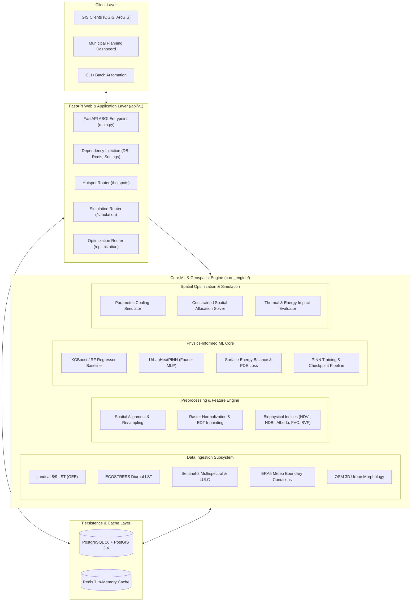
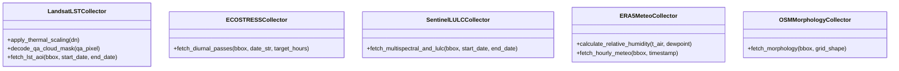
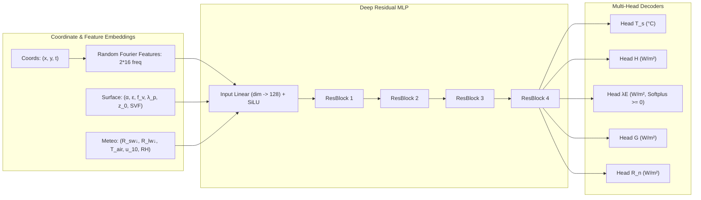
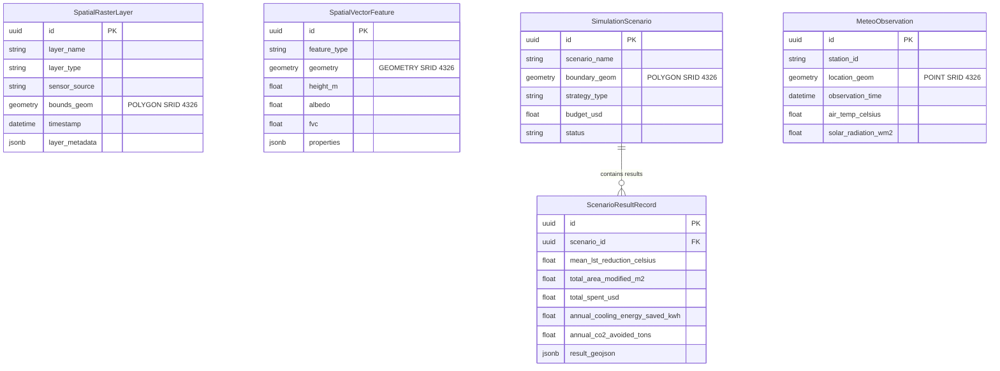
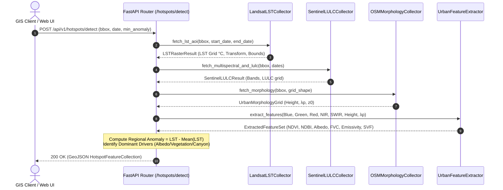
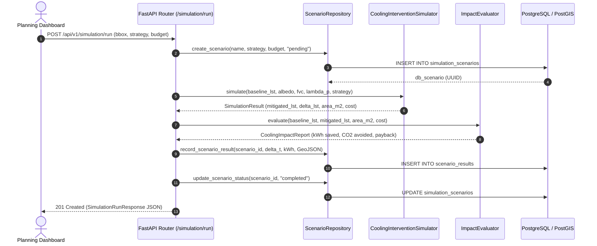
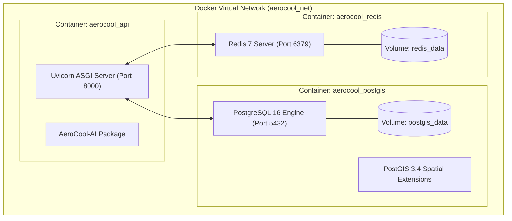

# AeroCool-AI System Architecture & Technical Specification

> **Document Version:** 1.0.0  
> **Target Audience:** Systems Architects, Machine Learning Engineers, Geospatial Analysts, and Core Developers.  
> **Scope:** Complete architectural topology, subsystem design, mathematical physics formulation, data flow, and deployment infrastructure.

---

## 1. High-Level System Architecture

**AeroCool-AI** is architected as a modular, decoupled, and asynchronous platform following the **Layered Architecture Pattern** and the **Single-Responsibility Principle (SRP)**.

```mermaid
graph TB
    subgraph Clients ["Client Layer"]
        GIS["GIS Clients (QGIS, ArcGIS)"]
        DASH["Municipal Planning Dashboard"]
        CLI["CLI / Batch Automation"]
    end

    subgraph API ["FastAPI Web & Application Layer (/api/v1)"]
        MAIN["FastAPI ASGI Entrypoint (main.py)"]
        DEP["Dependency Injection (DB, Redis, Settings)"]
        R_HOT["Hotspot Router (/hotspots)"]
        R_SIM["Simulation Router (/simulation)"]
        R_OPT["Optimization Router (/optimization)"]
    end

    subgraph CoreEngine ["Core ML & Geospatial Engine (core_engine/)"]
        subgraph Ingestion ["Data Ingestion Subsystem"]
            COL_L8["Landsat 8/9 LST (GEE)"]
            COL_ECO["ECOSTRESS Diurnal LST"]
            COL_S2["Sentinel-2 Multispectral & LULC"]
            COL_ERA5["ERA5 Meteo Boundary Conditions"]
            COL_OSM["OSM 3D Urban Morphology"]
        end

        subgraph Preproc ["Preprocessing & Feature Engine"]
            ALIGN["Spatial Alignment & Resampling"]
            NORM["Raster Normalization & EDT Inpainting"]
            FEAT["Biophysical Indices (NDVI, NDBI, Albedo, FVC, SVF)"]
        end

        subgraph Models ["Physics-Informed ML Core"]
            BASE["XGBoost / RF Regressor Baseline"]
            PINN["UrbanHeatPINN (Fourier MLP)"]
            LOSS["Surface Energy Balance & PDE Loss"]
            TRAIN["PINN Training & Checkpoint Pipeline"]
        end

        subgraph Optimization ["Spatial Optimization & Simulation"]
            SIM["Parametric Cooling Simulator"]
            ALLOC["Constrained Spatial Allocation Solver"]
            IMPACT["Thermal & Energy Impact Evaluator"]
        end
    end

    subgraph Persistence ["Persistence & Cache Layer"]
        PG[(PostgreSQL 16 + PostGIS 3.4)]
        REDIS[(Redis 7 In-Memory Cache)]
    end

    Clients <--> API
    API --> CoreEngine
    API <--> Persistence
    CoreEngine <--> Persistence
```

---

## 2. Subsystem Deconstruction

### 2.1. Remote Sensing & Data Ingestion Subsystem
Located in [`src/aerocool_ai/core_engine/ingestion/`](file:///C:/Users/mayan/Development/Projects/AeroCool-AI/src/aerocool_ai/core_engine/ingestion/README.md).

```mermaid
classDiagram
    class LandsatLSTCollector {
        +apply_thermal_scaling(dn)
        +decode_qa_cloud_mask(qa_pixel)
        +fetch_lst_aoi(bbox, start_date, end_date)
    }
    class ECOSTRESSCollector {
        +fetch_diurnal_passes(bbox, date_str, target_hours)
    }
    class SentinelLULCCollector {
        +fetch_multispectral_and_lulc(bbox, start_date, end_date)
    }
    class ERA5MeteoCollector {
        +calculate_relative_humidity(t_air, dewpoint)
        +fetch_hourly_meteo(bbox, timestamp)
    }
    class OSMMorphologyCollector {
        +fetch_morphology(bbox, grid_shape)
    }
```

1. **Google Earth Engine Landsat 8/9 Collector** (`gee_landsat_collector.py`):
   - Authenticates via Service Account JSON key or Google Cloud OAuth Project ID.
   - Filters `LANDSAT/LC08/C02/T1_L2` and `LANDSAT/LC09/C02/T1_L2` collections.
   - Applies QA_PIXEL bitmask decoding (clearing dilated cloud, cirrus, cloud shadow).
   - Calibrates raw thermal digital numbers ($\text{ST\_B10}$) into degrees Celsius.
2. **NASA ECOSTRESS Collector** (`ecostress_collector.py`):
   - Captures diurnal thermal cycles across non-sun-synchronous orbital overpasses (morning, solar noon, afternoon, night).
   - Quantifies thermal lag and nocturnal heat retention of dense concrete fabrics.
3. **Sentinel-2 & LULC Collector** (`sentinel_lulc_collector.py`):
   - Ingests surface reflectance bands (B2 Blue, B3 Green, B4 Red, B8 NIR, B11 SWIR-1, B12 SWIR-2).
   - Ingests 10m categorical Land Use / Land Cover (LULC) data (ESA WorldCover / Dynamic World).
4. **ERA5-Land Meteo Collector** (`era5_meteo_collector.py`):
   - Reconstructs atmospheric boundary conditions: 2m Air Temperature ($T_{2m}$), Downward Shortwave Solar Flux ($R_{sw\downarrow}$), Downward Longwave Thermal Flux ($R_{lw\downarrow}$), 10m Wind Speed ($U_{10}$), Relative Humidity ($\text{RH}$), and Surface Pressure ($P_s$).
5. **OpenStreetMap 3D Morphology Collector** (`osm_morphology_collector.py`):
   - Queries building footprints and street networks via OSMnx and Overpass API.
   - Computes Building Plan Area Fraction ($\lambda_p$), Mean Building Height ($H_{\text{mean}}$), Frontal Area Index ($\lambda_f$), and Grimmond & Oke Aerodynamic Roughness Length ($z_0 = 0.10 H_{\text{mean}} \sqrt{\lambda_p}$).

---

### 2.2. Preprocessing & Feature Extraction Engine
Located in [`src/aerocool_ai/core_engine/preprocessing/`](file:///C:/Users/mayan/Development/Projects/AeroCool-AI/src/aerocool_ai/core_engine/preprocessing/README.md).

- **Spatial Alignment Pipeline** (`spatial_alignment.py`):
  - Standardizes rasters of varying native resolutions (10m, 30m, 70m, 0.1°) to a target computational grid (default $64 \times 64$ or $128 \times 128$).
  - Employs **bilinear spline interpolation** for continuous microclimatic variables and **nearest-neighbor interpolation** for categorical LULC grids.
- **Raster Normalizer & Inpainter** (`raster_normalizer.py`):
  - Provides channel-wise `minmax`, `zscore`, and `robust` (IQR) feature scaling.
  - Implements **Euclidean Distance Transform (EDT)** spatial inpainting for cloud-occluded and NoData pixels with Gaussian boundary smoothing.
- **Urban Feature Extractor** (`feature_extractor.py`):
  - Computes biophysical indices:
    - $\text{NDVI} = \frac{\text{NIR} - \text{Red}}{\text{NIR} + \text{Red}}$
    - $\text{NDBI} = \frac{\text{SWIR} - \text{NIR}}{\text{SWIR} + \text{NIR}}$
    - $\text{NDWI} = \frac{\text{Green} - \text{NIR}}{\text{Green} + \text{NIR}}$
    - Liang (2001) broadband shortwave albedo: $\alpha = 0.356 B_2 + 0.130 B_4 + 0.373 B_8 + 0.085 B_{11} + 0.072 B_{12} - 0.0018$
    - Fractional Vegetation Cover: $\text{FVC} = \left(\frac{\text{NDVI} - 0.05}{0.70 - 0.05}\right)^2$
    - Thermal Emissivity ($\varepsilon$) via Sobrino NDVI thresholds.
    - Sky View Factor ($\text{SVF}$) derived from building heights and street canyon aspect ratios.

---

### 2.3. Physics-Informed Machine Learning Core (PINN)
Located in [`src/aerocool_ai/core_engine/models/`](file:///C:/Users/mayan/Development/Projects/AeroCool-AI/src/aerocool_ai/core_engine/models/README.md).

```mermaid
flowchart LR
    subgraph InputEmbeddings ["Coordinate & Feature Embeddings"]
        X["Coords: (x, y, t)"] --> RFF["Random Fourier Features: 2*16 freq"]
        S["Surface: (α, ε, f_v, λ_p, z_0, SVF)"]
        M["Meteo: (R_sw↓, R_lw↓, T_air, u_10, RH)"]
    end

    subgraph Backbone ["Deep Residual MLP"]
        RFF & S & M --> IN["Input Linear (dim -> 128) + SiLU"]
        IN --> B1["ResBlock 1"] --> B2["ResBlock 2"] --> B3["ResBlock 3"] --> B4["ResBlock 4"]
    end

    subgraph Decoders ["Multi-Head Decoders"]
        B4 --> H_TS["Head T_s (°C)"]
        B4 --> H_H["Head H (W/m²)"]
        B4 --> H_LE["Head λE (W/m², Softplus >= 0)"]
        B4 --> H_G["Head G (W/m²)"]
        B4 --> H_RN["Head R_n (W/m²)"]
    end
```

#### Governing Physics Laws:
1. **Surface Energy Balance Conservation Loss**:
   $$\mathcal{L}_{\text{SEB}} = \frac{1}{N} \sum_{i=1}^N \left( R_{n, i} - (G_i + H_i + \lambda E_i) \right)^2$$
2. **Stefan-Boltzmann Net Radiative Equilibrium Loss**:
   $$\mathcal{L}_{\text{Rad}} = \frac{1}{N} \sum_{i=1}^N \left( R_{n, i} - \left[ (1 - \alpha_i) R_{sw\downarrow, i} + \varepsilon_i R_{lw\downarrow, i} - \varepsilon_i \sigma (T_{s, i} + 273.15)^4 \right] \right)^2$$
3. **Aerodynamic Sensible Heat Exchange Loss**:
   $$\mathcal{L}_{\text{Sens}} = \frac{1}{N} \sum_{i=1}^N \left( H_i - \left[ \rho_{\text{air}} c_p \frac{T_{s, i} - T_{\text{air}, i}}{r_{a, i}} \right] \right)^2, \quad r_a = \frac{\ln(z / z_0)^2}{\kappa^2 u_{10}}$$
4. **Transient 2D Advection-Diffusion Thermal PDE Residual**:
   $$\mathcal{L}_{\text{PDE}} = \frac{1}{N} \sum_{i=1}^N \left( \frac{\partial T_s}{\partial t} - D \left( \frac{\partial^2 T_s}{\partial x^2} + \frac{\partial^2 T_s}{\partial y^2} \right) + \mathbf{u} \cdot \nabla T_s - \frac{\mathcal{R}_{\text{SEB}}}{\rho C_{\text{eff}}} \right)^2$$
   *(Partial derivatives are evaluated exactly using PyTorch autograd graph backward passes).*

---

### 2.4. Urban Cooling Optimization & Simulation Engine
Located in [`src/aerocool_ai/core_engine/optimization/`](file:///C:/Users/mayan/Development/Projects/AeroCool-AI/src/aerocool_ai/core_engine/optimization/README.md).

1. **Parametric Cooling Intervention Simulator** (`cooling_simulator.py`):
   - Models physical thermodynamic shifts:
     - **Green Roofs**: $\Delta \alpha \approx +0.08, \Delta f_v \approx +0.65$, latent heat enhancement $\lambda E \uparrow$.
     - **Cool Roofs**: $\Delta \alpha \approx +0.45$, solar absorption reduction $S_{\text{abs}} = (1 - \alpha) R_{sw\downarrow}$.
     - **Urban Tree Canopies**: Shading factor $0.60$, solar attenuation $e^{-k \cdot \text{LAI}}$, roughness increase.
     - **Cool / Permeable Pavements**: Surface albedo boost $+0.30$, moisture retention latent cooling.
2. **Constrained Spatial Allocation Solver** (`spatial_allocator.py`):
   - Solves multi-objective resource allocation:
     $$\max \sum_{i \in \text{Parcels}} \left( \Delta T_i \times \text{HVI}_i \times \text{Area}_i \right) \quad \text{s.t.} \quad \sum_{i, k} c_k \cdot x_{i, k} \le \text{Budget}_{\text{total}}$$
   - Generates multi-budget **Pareto Efficiency Frontiers** identifying optimal cost-benefit knee points.
3. **Impact & Socioeconomic Evaluator** (`impact_evaluator.py`):
   - Calculates 2m canopy air temperature reduction ($\Delta T_{\text{air}} \approx 0.35 \Delta T_{\text{LST}}$).
   - Computes avoided annual building HVAC cooling electricity ($3.8\,\text{kWh} / (\text{m}^2 \cdot ^\circ\text{C} \cdot \text{year})$).
   - Computes avoided grid carbon emissions ($0.385\,\text{kg}\,\text{CO}_2 / \text{kWh}$) and capital payback period.

---

### 2.5. Persistence & PostGIS Spatial Data Layer
Located in [`src/aerocool_ai/database/`](file:///C:/Users/mayan/Development/Projects/AeroCool-AI/src/aerocool_ai/database/README.md).

```mermaid
erDiagram
    SpatialRasterLayer {
        uuid id PK
        string layer_name
        string layer_type
        string sensor_source
        geometry bounds_geom "POLYGON SRID 4326"
        datetime timestamp
        jsonb layer_metadata
    }

    SpatialVectorFeature {
        uuid id PK
        string feature_type
        geometry geometry "GEOMETRY SRID 4326"
        float height_m
        float albedo
        float fvc
        jsonb properties
    }

    SimulationScenario ||--o{ ScenarioResultRecord : "contains results"
    SimulationScenario {
        uuid id PK
        string scenario_name
        geometry boundary_geom "POLYGON SRID 4326"
        string strategy_type
        float budget_usd
        string status
    }

    ScenarioResultRecord {
        uuid id PK
        uuid scenario_id FK
        float mean_lst_reduction_celsius
        float total_area_modified_m2
        float total_spent_usd
        float annual_cooling_energy_saved_kwh
        float annual_co2_avoided_tons
        jsonb result_geojson
    }

    MeteoObservation {
        uuid id PK
        string station_id
        geometry location_geom "POINT SRID 4326"
        datetime observation_time
        float air_temp_celsius
        float solar_radiation_wm2
    }
```

- **Async Connection Pool** (`connection.py`): Managed async session generator with automatic transaction rollback on failure.
- **Layer Repository** (`layer_repository.py`): Implements spatial bounding box intersection queries using PostGIS `ST_Intersects` and `ST_MakeEnvelope`.
- **Scenario Repository** (`scenario_repository.py`): Manages simulation runs, audit logs, and result GeoJSON persistence.

---

### 2.6. FastAPI Web Layer & Schemas
Located in [`src/aerocool_ai/backend_api/`](file:///C:/Users/mayan/Development/Projects/AeroCool-AI/src/aerocool_ai/backend_api/README.md).

- **Route Controllers**:
  - `POST /api/v1/hotspots/detect`: Full UHI hotspot detection pipeline returning RFC 7946 GeoJSON.
  - `GET /api/v1/hotspots/{hotspot_id}`: Granular thermodynamic diagnostic profile.
  - `POST /api/v1/simulation/run`: Parametric simulation with PostGIS scenario persistence.
  - `GET /api/v1/simulation/{scenario_id}`: Historical scenario results.
  - `POST /api/v1/optimization/allocate`: Budget-constrained spatial intervention allocation.
  - `POST /api/v1/optimization/pareto`: Multi-budget Pareto efficiency frontier analysis.
- **Dependency Providers** (`dependencies.py`):
  - `get_db()`: Scoped `AsyncSession` database injection.
  - `get_redis_client()`: High-speed async cache with fallback in-memory mock.
  - `get_app_settings()`: Cached settings singleton.

---

## 3. End-to-End Execution Sequence Diagrams

### 3.1. Hotspot Detection Sequence

```mermaid
sequenceDiagram
    autonumber
    actor Client as GIS Client / Web UI
    participant API as FastAPI Router (/hotspots/detect)
    participant LST as LandsatLSTCollector
    participant S2 as SentinelLULCCollector
    participant OSM as OSMMorphologyCollector
    participant FEAT as UrbanFeatureExtractor

    Client->>API: POST /api/v1/hotspots/detect (bbox, date, min_anomaly)
    API->>LST: fetch_lst_aoi(bbox, start_date, end_date)
    LST-->>API: LSTRasterResult (LST Grid °C, Transform, Bounds)
    API->>S2: fetch_multispectral_and_lulc(bbox, dates)
    S2-->>API: SentinelLULCResult (Bands, LULC grid)
    API->>OSM: fetch_morphology(bbox, grid_shape)
    OSM-->>API: UrbanMorphologyGrid (Height, λp, z0)
    API->>FEAT: extract_features(Blue, Green, Red, NIR, SWIR, Height, λp)
    FEAT-->>API: ExtractedFeatureSet (NDVI, NDBI, Albedo, FVC, Emissivity, SVF)
    Note over API: Compute Regional Anomaly = LST - Mean(LST)<br/>Identify Dominant Drivers (Albedo/Vegetation/Canyon)
    API-->>Client: 200 OK (GeoJSON HotspotFeatureCollection)
```

---

### 3.2. Simulation & Persistence Sequence

```mermaid
sequenceDiagram
    autonumber
    actor Client as Planning Dashboard
    participant API as FastAPI Router (/simulation/run)
    participant DB_REPO as ScenarioRepository
    participant SIM as CoolingInterventionSimulator
    participant EVAL as ImpactEvaluator
    participant PG as PostgreSQL / PostGIS

    Client->>API: POST /api/v1/simulation/run (bbox, strategy, budget)
    API->>DB_REPO: create_scenario(name, strategy, budget, "pending")
    DB_REPO->>PG: INSERT INTO simulation_scenarios
    PG-->>DB_REPO: db_scenario (UUID)
    API->>SIM: simulate(baseline_lst, albedo, fvc, lambda_p, strategy)
    SIM-->>API: SimulationResult (mitigated_lst, delta_lst, area_m2, cost)
    API->>EVAL: evaluate(baseline_lst, mitigated_lst, area_m2, cost)
    EVAL-->>API: CoolingImpactReport (kWh saved, CO2 avoided, payback)
    API->>DB_REPO: record_scenario_result(scenario_id, delta_t, kWh, GeoJSON)
    DB_REPO->>PG: INSERT INTO scenario_results
    API->>DB_REPO: update_scenario_status(scenario_id, "completed")
    DB_REPO->>PG: UPDATE simulation_scenarios
    API-->>Client: 201 Created (SimulationRunResponse JSON)
```

---

## 4. Cross-Cutting Design Patterns

### 4.1. Single-Responsibility Principle (SRP)
Every submodule is decoupled from adjacent concerns:
- Ingestion collectors **only** query, calibrate, and return structured dataclasses.
- Preprocessing pipelines **never** invoke HTTP endpoints or database sessions.
- PINN models and loss functions **only** consume and emit PyTorch tensors.
- Repositories **strictly** encapsulate SQL queries and PostGIS functions.

### 4.2. Offline Resilience & High-Fidelity Synthetic Fallbacks
To support air-gapped development, automated unit testing, and CI/CD pipelines without requiring active Earth Engine tokens or Overpass network access:
- `LandsatLSTCollector`, `ECOSTRESSCollector`, `SentinelLULCCollector`, and `OSMMorphologyCollector` implement deterministic, physics-grounded synthetic grid generators when remote API credentials are absent.
- The entire test suite runs offline in seconds.

### 4.3. High-Performance Asynchronous Concurrency
- Network I/O (satellite STAC queries, Overpass API), database transactions (`asyncpg`), and cache lookups (`redis.asyncio`) run concurrently in non-blocking asyncio event loops.
- CPU/GPU-intensive tensor forward passes and autograd PDE calculations leverage PyTorch's native C++ CUDA/CPU backend.

---

## 5. Deployment & Container Topology

```mermaid
graph TB
    subgraph Host ["Docker Virtual Network (aerocool_net)"]
        subgraph C_API ["Container: aerocool_api"]
            UVICORN["Uvicorn ASGI Server (Port 8000)"]
            APP["AeroCool-AI Package"]
        end

        subgraph C_DB ["Container: aerocool_postgis"]
            PG_CORE["PostgreSQL 16 Engine (Port 5432)"]
            POSTGIS_EXT["PostGIS 3.4 Spatial Extensions"]
            VOL_DB[("Volume: postgis_data")]
        end

        subgraph C_REDIS ["Container: aerocool_redis"]
            REDIS_CORE["Redis 7 Server (Port 6379)"]
            VOL_REDIS[("Volume: redis_data")]
        end
    end

    UVICORN <--> PG_CORE
    UVICORN <--> REDIS_CORE
    PG_CORE --- VOL_DB
    REDIS_CORE --- VOL_REDIS
```

---

## 6. Directory Layout Reference

| Path | Purpose |
|---|---|
| [`src/aerocool_ai/config.py`](file:///C:/Users/mayan/Development/Projects/AeroCool-AI/src/aerocool_ai/config.py) | Pydantic BaseSettings and credential management. |
| [`src/aerocool_ai/core_engine/ingestion/`](file:///C:/Users/mayan/Development/Projects/AeroCool-AI/src/aerocool_ai/core_engine/ingestion/README.md) | Remote sensing data acquisition collectors (Landsat, ECOSTRESS, Sentinel-2, ERA5, OSM). |
| [`src/aerocool_ai/core_engine/preprocessing/`](file:///C:/Users/mayan/Development/Projects/AeroCool-AI/src/aerocool_ai/core_engine/preprocessing/README.md) | Spatial grid alignment, EDT inpainting, and biophysical feature extraction. |
| [`src/aerocool_ai/core_engine/models/`](file:///C:/Users/mayan/Development/Projects/AeroCool-AI/src/aerocool_ai/core_engine/models/README.md) | PyTorch PINN model, SEB physics loss, and training loop. |
| [`src/aerocool_ai/core_engine/optimization/`](file:///C:/Users/mayan/Development/Projects/AeroCool-AI/src/aerocool_ai/core_engine/optimization/README.md) | Parametric cooling simulator, constrained allocator, and impact evaluator. |
| [`src/aerocool_ai/frontend/`](file:///C:/Users/mayan/Development/Projects/AeroCool-AI/src/aerocool_ai/frontend/README.md) | Streamlit interactive geospatial dashboard with Folium maps, simulation sliders, and Pareto curves. |
| [`src/aerocool_ai/database/`](file:///C:/Users/mayan/Development/Projects/AeroCool-AI/src/aerocool_ai/database/README.md) | PostGIS models, async SQLAlchemy 2.0 connection pool, and repositories. |
| [`src/aerocool_ai/backend_api/`](file:///C:/Users/mayan/Development/Projects/AeroCool-AI/src/aerocool_ai/backend_api/README.md) | FastAPI application, dependency injection, and REST route controllers. |
| [`src/aerocool_ai/misc_scripts/`](file:///C:/Users/mayan/Development/Projects/AeroCool-AI/src/aerocool_ai/misc_scripts/README.md) | PostGIS initialization and database provisioning scripts. |
| [`tests/`](file:///C:/Users/mayan/Development/Projects/AeroCool-AI/tests/README.md) | Pytest async unit and integration verification suite. |
