# AeroCool-AI: Physics-Informed Geospatial Urban Cooling Engine

[](https://www.python.org/downloads/)
[](https://fastapi.tiangolo.com)
[](https://pytorch.org/)
[](https://postgis.net/)
[](https://github.com/astral-sh/uv)

**AeroCool-AI** is an enterprise-grade Physics-Informed Machine Learning (PINN) and geospatial analytics engine designed to detect Urban Heat Island (UHI) hotspots, quantify thermodynamic heating drivers (LULC, 3D morphology, meteorology), and optimize spatial cooling interventions (green roofs, high-albedo cool coatings, urban tree canopies, permeable pavements).

---

## Architecture Overview

```mermaid
flowchart TB
    subgraph DataIngestion ["1. Multi-Source Geospatial Ingestion"]
        GEE["Landsat 8/9 LST (GEE)"]
        ECO["ECOSTRESS Diurnal LST"]
        S2["Sentinel-2 L2A & LULC"]
        ERA5["ERA5 Reanalysis Meteo"]
        OSM["OSM 3D Morphology & Canyons"]
    end

    subgraph Preprocessing ["2. Spatial Alignment & Biophysical Engine"]
        ALIGN["Spatial Alignment & Resampling"]
        NORM["Normalizer & NoData Inpainting"]
        FEAT["Biophysical Indices (NDVI, NDBI, Albedo, FVC, Emissivity, SVF)"]
    end

    subgraph Modeling ["3. Physics-Informed ML Core (PINN)"]
        BASELINE["XGBoost / RF Baseline Regressors"]
        PINN["UrbanHeatPINN (PyTorch Fourier MLP)"]
        SEB["Surface Energy Balance Loss (Rn - G - H - λE = 0)"]
        PDE["2D Advection-Diffusion Thermal PDE"]
    end

    subgraph Optimization ["4. Intervention Simulation & Spatial Allocation"]
        SIM["Parametric Cooling Simulator (Green/Cool Roofs, Trees, Pavements)"]
        SOLVER["Constrained Spatial Allocation Solver (Budget, HVI, Suitability)"]
        IMPACT["Impact & Energy Evaluator (ΔT, UTCI, kWh Saved, CO2)"]
    end

    subgraph Persistence ["5. PostGIS Persistence Layer"]
        DB[(PostgreSQL 16 + PostGIS 3.4)]
        LAYERS["Spatial Raster/Vector Catalog"]
        SCENARIOS["Simulation Scenarios & Result Logs"]
    end

    subgraph WebAPI ["6. FastAPI Web Layer"]
        API["FastAPI ASGI Server (/api/v1)"]
        HOTSPOT_EP["/api/v1/hotspots/detect"]
        SIM_EP["/api/v1/simulation/run"]
        OPT_EP["/api/v1/optimization/allocate"]
        PARETO_EP["/api/v1/optimization/pareto"]
    end

    DataIngestion --> Preprocessing
    Preprocessing --> Modeling
    Modeling --> Optimization
    Optimization --> Persistence
    Persistence <--> WebAPI
```



---

## Directory Structure

```text
AeroCool-AI/
├── pyproject.toml                         # uv project configuration & dependencies
├── uv.lock                                # Locked dependency tree
├── .python-version                        # Python 3.14 specification
├── .gitignore                             # Git ignore rules
├── .env.example                           # Environment configuration template
├── README.md                              # Technical documentation
├── Dockerfile                             # Container build file
├── docker-compose.yml                     # Multi-service composition (PostGIS, Redis, API)
│
├── src/
│   └── aerocool_ai/
│       ├── __init__.py                    # Main package entrypoint & CLI
│       ├── config.py                      # Pydantic BaseSettings (App, DB, GEE, Models)
│       │
│       ├── core_engine/                   # AI/ML & Remote Sensing Core
│       │   ├── __init__.py
│       │   ├── ingestion/                 # Remote sensing & geospatial ingestion
│       │   │   ├── gee_landsat_collector.py   # Landsat 8/9 LST via Google Earth Engine
│       │   │   ├── ecostress_collector.py     # ECOSTRESS diurnal thermal passes
│       │   │   ├── sentinel_lulc_collector.py # Sentinel-2 multispectral & LULC
│       │   │   ├── era5_meteo_collector.py    # ERA5 hourly atmospheric forcings
│       │   │   └── osm_morphology_collector.py# OSM building heights & plan area fraction
│       │   ├── preprocessing/             # Spatial normalization & indices
│       │   │   ├── spatial_alignment.py       # Reprojection, clipping & grid matching
│       │   │   ├── raster_normalizer.py       # MinMax, Z-score, NoData inpainting
│       │   │   └── feature_extractor.py       # NDVI, NDBI, Albedo, FVC, Emissivity, SVF
│       │   ├── models/                    # Physics-Informed models & training
│       │   │   ├── baseline_regressor.py      # XGBoost & Random Forest benchmarks
│       │   │   ├── pinn_heat_dynamics.py      # PyTorch PINN with Fourier coordinate mapping
│       │   │   ├── loss_functions.py          # Surface Energy Balance & PDE residual loss
│       │   │   └── train_pipeline.py          # Training loop, scheduler & checkpointing
│       │   └── optimization/              # Heat mitigation solvers
│       │       ├── cooling_simulator.py       # Parametric cooling intervention models
│       │       ├── spatial_allocator.py       # Constrained budget allocation solver
│       │       └── impact_evaluator.py        # ΔT, UTCI comfort, kWh savings, CO2 reduction
│       │
│       ├── frontend/                      # React 19 / TypeScript SPA Geospatial Client
│       │   ├── package.json               # NPM dependencies & scripts (React/Vite)
│       │   ├── vite.config.ts             # Vite bundler & API proxy (with rollup code-splitting)
│       │   ├── tsconfig.json              # TypeScript configuration
│       │   ├── tailwind.config.js         # Tailwind CSS styling & glassmorphism theme
│       │   ├── index.html                 # HTML5 entrypoint with Google Fonts
│       │   ├── src/                       # React components & services
│       │   ├── dist/                      # Pre-compiled production React SPA bundle
│       │   └── README.md
│       │
│       ├── database/                      # PostGIS Persistence Layer
│       │   ├── __init__.py
│       │   ├── connection.py              # Async SQLAlchemy 2.0 engine & sessionmaker
│       │   ├── models/                    # Declarative GeoAlchemy2 tables
│       │   │   ├── spatial_layers.py          # Raster and vector catalog tables
│       │   │   ├── scenario_results.py        # Scenario configurations & ΔT output logs
│       │   │   └── sensor_meteo.py            # In-situ weather station observations
│       │   └── repositories/              # Asynchronous spatial queries
│       │       ├── layer_repository.py        # PostGIS ST_Intersects / ST_MakeEnvelope
│       │       └── scenario_repository.py     # Scenario tracking & result logging
│       │
│       ├── backend_api/                   # FastAPI Web Layer
│       │   ├── __init__.py
│       │   ├── main.py                    # ASGI application & lifespan manager
│       │   ├── dependencies.py            # DB, Cache, Settings injection
│       │   ├── schemas/                   # Pydantic v2 schemas
│       │   │   ├── hotspot_schema.py          # GeoJSON UHI hotspot representations
│       │   │   ├── scenario_request.py        # Simulation payloads & responses
│       │   │   └── optimization_response.py   # Spatial placement & Pareto responses
│       │   └── routes/                    # API Route controllers
│       │       ├── hotspots.py                # Hotspot detection endpoints
│       │       ├── simulation.py              # Scenario execution endpoints
│       │       └── optimization.py            # Optimization & Pareto endpoints
│       │
│       └── misc_scripts/                  # Utilities & Database Migrations
│           ├── __init__.py
│           └── initialize_postgis.py          # PostGIS extension & table provisioner
│
└── tests/                                 # Pytest Verification Suite
    ├── conftest.py                        # Async fixtures & test client
    ├── test_config.py                     # Configuration validation tests
    ├── test_ingestion.py                  # Remote sensing ingestion tests
    ├── test_preprocessing.py              # Preprocessing & index calculation tests
    ├── test_models.py                     # PINN autograd, SEB loss & ML regressor tests
    ├── test_optimization.py              # Simulator, allocator & evaluator tests
    └── test_api.py                        # FastAPI integration tests
```

---

## Scientific Principles & Physics-Informed Formulation

### 1. Surface Energy Balance (SEB) Equation
At the urban canopy surface, thermal equilibrium requires the net radiative energy flux to balance turbulent and conductive fluxes:

$$R_n - G - H - \lambda E = 0$$

Where:
- **Net Radiation ($R_n$)**:
  $$R_n = (1 - \alpha) R_{sw\downarrow} + \varepsilon R_{lw\downarrow} - \varepsilon \sigma (T_s + 273.15)^4$$
  - $\alpha$: Broadband surface albedo (calculated via Liang 2001 multispectral formula across Sentinel-2 bands $B_2, B_4, B_8, B_{11}, B_{12}$)
  - $\varepsilon$: Surface thermal emissivity (derived via Sobrino NDVI thresholds and vegetation cavity effect)
  - $\sigma = 5.670374 \times 10^{-8} \, \text{W}/(\text{m}^2 \text{K}^4)$: Stefan-Boltzmann constant
  - $R_{sw\downarrow}, R_{lw\downarrow}$: Downward shortwave solar and longwave atmospheric radiation from ERA5-Land
- **Sensible Heat Flux ($H$)**:
  $$H = \rho_{\text{air}} c_p \frac{T_s - T_{\text{air}}}{r_a}$$
  - $\rho = 1.205 \, \text{kg/m}^3, c_p = 1005 \, \text{J}/(\text{kg}\cdot\text{K})$
  - $r_a = \frac{\ln(z / z_0)^2}{\kappa^2 u_{10}}$: Aerodynamic resistance to heat transfer ($z_0$ roughness derived from OSM 3D morphology via Grimmond & Oke formula: $z_0 = 0.10 H_{\text{mean}} \sqrt{\lambda_p}$)
- **Latent Heat Flux ($\lambda E$)**:
  $$\lambda E = f_v \cdot \text{ET}_0(R_n, T_{\text{air}}, u_{10}, \text{RH})$$
  - $f_v$: Fractional Vegetation Cover (FVC)
- **Ground / Structural Conductive Heat Storage ($G$)**:
  $$G = \mu R_n \quad (\mu \approx 0.15 - 0.40 \text{ in dense urban asphalt/concrete})$$

### 2. Spatiotemporal Advection-Diffusion PDE Loss
$$\mathcal{R}_{\text{PDE}} = \frac{\partial T_s}{\partial t} - D \left( \frac{\partial^2 T_s}{\partial x^2} + \frac{\partial^2 T_s}{\partial y^2} \right) + \mathbf{u} \cdot \nabla T_s - \frac{R_n - G - H - \lambda E}{\rho C_{\text{eff}}} = 0$$

The `UrbanHeatPINN` computes exact partial derivatives $\frac{\partial T_s}{\partial t}, \nabla^2 T_s$ using PyTorch Autograd to penalize violations of physical thermodynamics during neural training, preventing unphysical temperature predictions.

---

## Step-by-Step Setup Guide

Follow these sequential steps to set up and launch AeroCool-AI on your local workstation.

### Step 1: Install System Prerequisites
1. **Python `>=3.12`**: Ensure Python is installed.
2. **Astral `uv`**: Ultra-fast Python package and project manager.
   ```powershell
   # Windows (PowerShell)
   powershell -ExecutionPolicy ByPass -c "irm https://astral.sh/uv/install.ps1 | iex"
   
   # Linux / macOS
   curl -LsSf https://astral.sh/uv/install.sh | sh
   ```
3. **Docker & Docker Desktop**: Required for PostgreSQL 16 + PostGIS 3.4 and Redis 7.
4. **Node.js `>=18` & npm**: For running the React 19 geospatial dashboard.

### Step 2: Clone & Synchronize Dependencies
```powershell
# Clone the repository
git clone https://github.com/Gesicht436/AeroCool-AI.git
cd AeroCool-AI

# Create virtual environment and synchronize dependencies via uv
uv sync
```

### Step 3: Configure Remote Sensing Credentials (`.env`)
Copy the environment template:
```powershell
cp .env.example .env
```

Open `.env` and fill in your remote sensing credentials:

1. **Google Earth Engine (GEE)** *(Landsat-8/9 thermal LST, Sentinel-2 L2A, and ESA WorldCover)*:
   - Create a Service Account in [Google Cloud Console](https://console.cloud.google.com/) with the roles **Earth Engine Editor (Beta)** (or **Earth Engine Resource Viewer**) and **Service Usage Consumer**.
   - Ensure the Google Earth Engine API is enabled and your project is registered at [console.earthengine.google.com](https://console.earthengine.google.com/).
   - Download the JSON key file.
   > [!IMPORTANT]
   > On Windows, always use forward slashes (`/`) in your `.env` file path to prevent Python escape sequence errors (e.g. `\b` becoming backspace):
   ```ini
   GEE_PROJECT_ID=your-gcp-project-id
   GEE_SERVICE_ACCOUNT=your-sa@your-project.iam.gserviceaccount.com
   GEE_PRIVATE_KEY_FILE=C:/path/to/credentials/gee-key.json
   ```

2. **NASA Earthdata** *(ECOSTRESS diurnal thermal observations)*:
   - Create a free account at [urs.earthdata.nasa.gov](https://urs.earthdata.nasa.gov/).
   - Generate a User Token under your profile:
   ```ini
   EARTHDATA_BEARER_TOKEN=your-nasa-token-here
   ```

3. **Copernicus Climate Data Store (CDS)** *(ERA5-Land hourly meteorology)*:
   - Create a free account at [cds.climate.copernicus.eu](https://cds.climate.copernicus.eu/).
   - Copy your Personal Access Token from your user profile:
   ```ini
   CDS_API_KEY=your-cds-token-here
   CDS_API_URL=https://cds.climate.copernicus.eu/api
   ```

4. **OpenStreetMap (OSM)**:
   - **Zero setup required.** Queries Overpass API dynamically via OSMnx.

### Step 4: Launch Infrastructure & Initialize Database
Start the spatial database and Redis cache containers:
```powershell
# Start PostGIS and Redis via Docker Compose
docker-compose up -d postgis redis
```

Once the containers are running and healthy, run the standalone provisioner to enable PostGIS extensions, create all ORM tables, and seed the default demo accounts:
```powershell
uv run python -m aerocool_ai.misc_scripts.initialize_postgis
```
*Seeded Demo Accounts:*
- **Admin**: `admin@aerocool.ai` (Password: `Admin@123`)
- **Customer / Planner**: `planner@aerocool.ai` (Password: `Planner@123`)

### Step 5: Launch FastAPI Backend
```powershell
uv run uvicorn aerocool_ai.backend_api.main:app --host 0.0.0.0 --port 8000 --reload
```
- **Interactive Swagger Documentation**: [http://localhost:8000/docs](http://localhost:8000/docs)
- **ReDoc Technical Reference**: [http://localhost:8000/redoc](http://localhost:8000/redoc)
- **System Health Diagnostic**: [http://localhost:8000/health](http://localhost:8000/health)

### Step 6: Launch React 19 Frontend
In a second terminal window:
```powershell
cd src/aerocool_ai/frontend
npm.cmd install
npm.cmd run dev
```
- **Interactive UI Dashboard**: [http://localhost:3000](http://localhost:3000)

*(Alternatively, the compiled production dashboard is served directly by FastAPI at [http://localhost:8000/dashboard](http://localhost:8000/dashboard)).*

---

## Interactive Dashboard Highlights

- **Indian City Presets**: 1-click geographic boundaries and climate zone profiles for Delhi NCR, Mumbai, Ahmedabad, Chennai, Bengaluru, and Hyderabad.
- **Dual Currency Engine**: Seamless live conversion between Indian Rupees (₹ Lakhs/Crores) and US Dollars ($ USD) for municipal budget planning.
- **1-Click Instant Demo Authentication**: Instant modal switching between `Admin User` (with live telemetry gauges and request audit stream) and `Customer User` (municipal climate planning).
- **A/B Policy Comparison**: Compare two distinct interventions (e.g. *Cool Roofs* vs *Urban Tree Canopies*) at equivalent capital expenditure.
- **Pareto Knapsack Efficiency Frontier**: Visualizes multi-budget trade-offs between capital spent and mean temperature reduction (°C), identifying the optimal knee point of diminishing returns.
- **Strict Error Mode**: Zero mock fallbacks—surfaces clear error alerts with live API status so issues are caught immediately.

---

## API Endpoints Reference

| Method | Path | Summary & Description |
|---|---|---|
| `POST` | `/api/v1/hotspots/detect` | Ingests satellite & morphology data, returns RFC 7946 GeoJSON UHI hotspots and driver analysis. |
| `GET` | `/api/v1/hotspots/{hotspot_id}` | Retrieves detailed thermodynamic profile and tailored mitigation recommendations. |
| `POST` | `/api/v1/simulation/run` | Simulates parametric urban cooling scenarios, evaluates energy/CO2 savings, and logs to PostGIS. |
| `GET` | `/api/v1/simulation/{scenario_id}`| Retrieves historical simulation results and spatial GeoJSON. |
| `GET` | `/api/v1/simulation` | Lists previous simulation runs with pagination. |
| `POST` | `/api/v1/optimization/allocate` | Solves budget-constrained multi-objective spatial allocation of cooling interventions. |
| `POST` | `/api/v1/optimization/pareto` | Computes Pareto efficiency frontier across investment budget steps. |
| `POST` | `/api/v1/auth/login` | Authenticates user with email/password and returns signed JWT token. |
| `POST` | `/api/v1/auth/register` | Registers new customer or admin municipal user accounts. |
| `POST` | `/api/v1/auth/demo-login/{role}` | Instant 1-click demo access for `admin` or `customer`. |
| `GET` | `/api/v1/admin/telemetry` | Retrieves system telemetry KPIs, P95 latency, cache efficiency, and error rates (Admin only). |
| `GET` | `/api/v1/admin/telemetry/logs` | Real-time live API audit request stream (Admin only). |
| `GET` | `/api/v1/admin/users` | Lists registered municipal users and roles (Admin only). |
| `GET` | `/api/v1/admin/health` | Hardware accelerator, CPU, memory, and satellite provider health diagnostics (Admin only). |

---

## Running Test Suite

```bash
# Run unit and integration tests
uv run pytest -v

# Run tests for specific submodules
uv run pytest tests/test_models.py -v
uv run pytest tests/test_api.py -v
uv run pytest tests/test_auth_and_admin.py -v
```

---

## License
GNU Affero General Public License v3.0 (AGPLv3). Developed for scalable urban climate resilience and AI-driven sustainable municipal planning. See [`LICENSE`](file:///C:/Users/mayan/Development/Projects/AeroCool-AI/LICENSE) for complete terms.
