# AeroCool-AI: Physics-Informed Geospatial Urban Cooling Engine

[](https://www.python.org/downloads/)
[](https://fastapi.tiangolo.com)
[](https://pytorch.org/)
[](https://postgis.net/)
[](https://github.com/astral-sh/uv)

**AeroCool-AI** is an enterprise-grade Physics-Informed Machine Learning (PINN) and geospatial analytics engine designed to detect Urban Heat Island (UHI) hotspots, quantify thermodynamic heating drivers (LULC, 3D morphology, meteorology), and optimize spatial cooling interventions (green roofs, high-albedo cool coatings, urban tree canopies, permeable pavements).

---

## Architecture Overview

```mermaid
flowchart TB
    subgraph DataIngestion ["1. Multi-Source Geospatial Ingestion"]
        GEE["Landsat 8/9 LST (GEE)"]
        ECO["ECOSTRESS Diurnal LST"]
        S2["Sentinel-2 L2A & LULC"]
        ERA5["ERA5 Reanalysis Meteo"]
        OSM["OSM 3D Morphology & Canyons"]
    end

    subgraph Preprocessing ["2. Spatial Alignment & Biophysical Engine"]
        ALIGN["Spatial Alignment & Resampling"]
        NORM["Normalizer & NoData Inpainting"]
        FEAT["Biophysical Indices (NDVI, NDBI, Albedo, FVC, Emissivity, SVF)"]
    end

    subgraph Modeling ["3. Physics-Informed ML Core (PINN)"]
        BASELINE["XGBoost / RF Baseline Regressors"]
        PINN["UrbanHeatPINN (PyTorch Fourier MLP)"]
        SEB["Surface Energy Balance Loss (Rn - G - H - λE = 0)"]
        PDE["2D Advection-Diffusion Thermal PDE"]
    end

    subgraph Optimization ["4. Intervention Simulation & Spatial Allocation"]
        SIM["Parametric Cooling Simulator (Green/Cool Roofs, Trees, Pavements)"]
        SOLVER["Constrained Spatial Allocation Solver (Budget, HVI, Suitability)"]
        IMPACT["Impact & Energy Evaluator (ΔT, UTCI, kWh Saved, CO2)"]
    end

    subgraph Persistence ["5. PostGIS Persistence Layer"]
        DB[(PostgreSQL 16 + PostGIS 3.4)]
        LAYERS["Spatial Raster/Vector Catalog"]
        SCENARIOS["Simulation Scenarios & Result Logs"]
    end

    subgraph WebAPI ["6. FastAPI Web Layer"]
        API["FastAPI ASGI Server (/api/v1)"]
        HOTSPOT_EP["/api/v1/hotspots/detect"]
        SIM_EP["/api/v1/simulation/run"]
        OPT_EP["/api/v1/optimization/allocate"]
        PARETO_EP["/api/v1/optimization/pareto"]
    end

    DataIngestion --> Preprocessing
    Preprocessing --> Modeling
    Modeling --> Optimization
    Optimization --> Persistence
    Persistence <--> WebAPI
```



---

## Directory Structure

```text
AeroCool-AI/
├── pyproject.toml                         # uv project configuration & dependencies
├── uv.lock                                # Locked dependency tree
├── .python-version                        # Python 3.14 specification
├── .gitignore                             # Git ignore rules
├── .env.example                           # Environment configuration template
├── README.md                              # Technical documentation
├── Dockerfile                             # Container build file
├── docker-compose.yml                     # Multi-service composition (PostGIS, Redis, API)
│
├── src/
│   └── aerocool_ai/
│       ├── __init__.py                    # Main package entrypoint & CLI
│       ├── config.py                      # Pydantic BaseSettings (App, DB, GEE, Models)
│       │
│       ├── core_engine/                   # AI/ML & Remote Sensing Core
│       │   ├── __init__.py
│       │   ├── ingestion/                 # Remote sensing & geospatial ingestion
│       │   │   ├── gee_landsat_collector.py   # Landsat 8/9 LST via Google Earth Engine
│       │   │   ├── ecostress_collector.py     # ECOSTRESS diurnal thermal passes
│       │   │   ├── sentinel_lulc_collector.py # Sentinel-2 multispectral & LULC
│       │   │   ├── era5_meteo_collector.py    # ERA5 hourly atmospheric forcings
│       │   │   └── osm_morphology_collector.py# OSM building heights & plan area fraction
│       │   ├── preprocessing/             # Spatial normalization & indices
│       │   │   ├── spatial_alignment.py       # Reprojection, clipping & grid matching
│       │   │   ├── raster_normalizer.py       # MinMax, Z-score, NoData inpainting
│       │   │   └── feature_extractor.py       # NDVI, NDBI, Albedo, FVC, Emissivity, SVF
│       │   ├── models/                    # Physics-Informed models & training
│       │   │   ├── baseline_regressor.py      # XGBoost & Random Forest benchmarks
│       │   │   ├── pinn_heat_dynamics.py      # PyTorch PINN with Fourier coordinate mapping
│       │   │   ├── loss_functions.py          # Surface Energy Balance & PDE residual loss
│       │   │   └── train_pipeline.py          # Training loop, scheduler & checkpointing
│       │   └── optimization/              # Heat mitigation solvers
│       │       ├── cooling_simulator.py       # Parametric cooling intervention models
│       │       ├── spatial_allocator.py       # Constrained budget allocation solver
│       │       └── impact_evaluator.py        # ΔT, UTCI comfort, kWh savings, CO2 reduction
│       │
│       ├── frontend/                      # React 19 / TypeScript SPA Geospatial Client
│       │   ├── package.json               # NPM dependencies & scripts (React/Vite)
│       │   ├── vite.config.ts             # Vite bundler & API proxy (with rollup code-splitting)
│       │   ├── tsconfig.json              # TypeScript configuration
│       │   ├── tailwind.config.js         # Tailwind CSS styling & glassmorphism theme
│       │   ├── index.html                 # HTML5 entrypoint with Google Fonts
│       │   ├── src/                       # React components & services
│       │   ├── dist/                      # Pre-compiled production React SPA bundle
│       │   └── README.md
│       │
│       ├── database/                      # PostGIS Persistence Layer
│       │   ├── __init__.py
│       │   ├── connection.py              # Async SQLAlchemy 2.0 engine & sessionmaker
│       │   ├── models/                    # Declarative GeoAlchemy2 tables
│       │   │   ├── spatial_layers.py          # Raster and vector catalog tables
│       │   │   ├── scenario_results.py        # Scenario configurations & ΔT output logs
│       │   │   └── sensor_meteo.py            # In-situ weather station observations
│       │   └── repositories/              # Asynchronous spatial queries
│       │       ├── layer_repository.py        # PostGIS ST_Intersects / ST_MakeEnvelope
│       │       └── scenario_repository.py     # Scenario tracking & result logging
│       │
│       ├── backend_api/                   # FastAPI Web Layer
│       │   ├── __init__.py
│       │   ├── main.py                    # ASGI application & lifespan manager
│       │   ├── dependencies.py            # DB, Cache, Settings injection
│       │   ├── schemas/                   # Pydantic v2 schemas
│       │   │   ├── hotspot_schema.py          # GeoJSON UHI hotspot representations
│       │   │   ├── scenario_request.py        # Simulation payloads & responses
│       │   │   └── optimization_response.py   # Spatial placement & Pareto responses
│       │   └── routes/                    # API Route controllers
│       │       ├── hotspots.py                # Hotspot detection endpoints
│       │       ├── simulation.py              # Scenario execution endpoints
│       │       └── optimization.py            # Optimization & Pareto endpoints
│       │
│       └── misc_scripts/                  # Utilities & Database Migrations
│           ├── __init__.py
│           └── initialize_postgis.py          # PostGIS extension & table provisioner
│
└── tests/                                 # Pytest Verification Suite
    ├── conftest.py                        # Async fixtures & test client
    ├── test_config.py                     # Configuration validation tests
    ├── test_ingestion.py                  # Remote sensing ingestion tests
    ├── test_preprocessing.py              # Preprocessing & index calculation tests
    ├── test_models.py                     # PINN autograd, SEB loss & ML regressor tests
    ├── test_optimization.py              # Simulator, allocator & evaluator tests
    └── test_api.py                        # FastAPI integration tests
```

---

## Scientific Principles & Physics-Informed Formulation

### 1. Surface Energy Balance (SEB) Equation
At the urban canopy surface, thermal equilibrium requires the net radiative energy flux to balance turbulent and conductive fluxes:

$$R_n - G - H - \lambda E = 0$$

Where:
- **Net Radiation ($R_n$)**:
  $$R_n = (1 - \alpha) R_{sw\downarrow} + \varepsilon R_{lw\downarrow} - \varepsilon \sigma (T_s + 273.15)^4$$
  - $\alpha$: Broadband surface albedo (calculated via Liang 2001 multispectral formula)
  - $\varepsilon$: Surface thermal emissivity (derived via Sobrino NDVI thresholds)
  - $\sigma = 5.670374 \times 10^{-8} \, \text{W}/(\text{m}^2 \text{K}^4)$: Stefan-Boltzmann constant
  - $R_{sw\downarrow}, R_{lw\downarrow}$: Downward shortwave solar and longwave atmospheric radiation
- **Sensible Heat Flux ($H$)**:
  $$H = \rho_{\text{air}} c_p \frac{T_s - T_{\text{air}}}{r_a}$$
  - $\rho = 1.205 \, \text{kg/m}^3, c_p = 1005 \, \text{J}/(\text{kg}\cdot\text{K})$
  - $r_a = \frac{\ln(z / z_0)^2}{\kappa^2 u_{10}}$: Aerodynamic resistance to heat transfer ($z_0$ from building morphology)
- **Latent Heat Flux ($\lambda E$)**:
  $$\lambda E = f_v \cdot \text{ET}_0(R_n, T_{\text{air}}, u_{10}, \text{RH})$$
  - $f_v$: Fractional Vegetation Cover (FVC)
- **Ground / Structural Conductive Heat Storage ($G$)**:
  $$G = \mu R_n \quad (\mu \approx 0.15 - 0.40 \text{ in dense urban asphalt/concrete})$$

### 2. Spatiotemporal Advection-Diffusion PDE Loss
$$\mathcal{R}_{\text{PDE}} = \frac{\partial T_s}{\partial t} - D \left( \frac{\partial^2 T_s}{\partial x^2} + \frac{\partial^2 T_s}{\partial y^2} \right) + \mathbf{u} \cdot \nabla T_s - \frac{R_n - G - H - \lambda E}{\rho C_{\text{eff}}}$$

The `UrbanHeatPINN` computes exact partial derivatives $\frac{\partial T_s}{\partial t}, \nabla^2 T_s$ using PyTorch Autograd to penalize violations of physical thermodynamics during neural training.

---

## Quickstart & Installation

### Prerequisites
- Python 3.14+
- `uv` package manager (`curl -LsSf https://astral.sh/uv/install.sh | sh` or `winget install astral-sh.uv`)
- Docker & Docker Compose (for PostgreSQL/PostGIS & Redis)

### Setup with `uv`

```bash
# Clone repository
git clone https://github.com/Gesicht436/AeroCool-AI.git
cd AeroCool-AI

# Create virtual environment and synchronize dependencies
uv sync

# Copy environment template
cp .env.example .env
```

### Launch Infrastructure & Database

```bash
# Start PostGIS and Redis via Docker Compose
docker-compose up -d postgis redis

# Initialize PostGIS extensions and tables
uv run python -m aerocool_ai.misc_scripts.initialize_postgis
```

### Start FastAPI Backend Application

```bash
# Run API server locally with hot reload
uv run uvicorn aerocool_ai.backend_api.main:app --host 0.0.0.0 --port 8000 --reload
```

Interactive OpenAPI Documentation:
- **Swagger UI**: [http://localhost:8000/docs](http://localhost:8000/docs)
- **ReDoc**: [http://localhost:8000/redoc](http://localhost:8000/redoc)
- **Health Check**: [http://localhost:8000/health](http://localhost:8000/health)

### Start Frontend Application

#### Option A: React 19 + TypeScript Dev Server (Port 3000)
```bash
# Navigate to frontend and start Vite HMR server
cd src/aerocool_ai/frontend
npm.cmd run dev
```
- **React Web Client**: [http://localhost:3000](http://localhost:3000)

#### Option B: Unified FastAPI Server (Serves API + React SPA on Port 8000)
```bash
# Start backend server from project root
uv run uvicorn aerocool_ai.backend_api.main:app --host 0.0.0.0 --port 8000 --reload
```
- **React Web Dashboard**: [http://localhost:8000/dashboard](http://localhost:8000/dashboard)
- **Interactive Swagger UI**: [http://localhost:8000/docs](http://localhost:8000/docs)
- **Health Check**: [http://localhost:8000/health](http://localhost:8000/health)

---

## API Endpoints Reference

| Method | Path | Summary |
|---|---|---|
| `POST` | `/api/v1/hotspots/detect` | Ingests satellite & morphology data, returns RFC 7946 GeoJSON UHI hotspots and driver analysis. |
| `GET` | `/api/v1/hotspots/{hotspot_id}` | Retrieves detailed thermodynamic profile and tailored mitigation recommendations. |
| `POST` | `/api/v1/simulation/run` | Simulates parametric urban cooling scenarios, evaluates energy/CO2 savings, and logs to PostGIS. |
| `GET` | `/api/v1/simulation/{scenario_id}`| Retrieves historical simulation results and spatial GeoJSON. |
| `GET` | `/api/v1/simulation` | Lists previous simulation runs with pagination. |
| `POST` | `/api/v1/optimization/allocate` | Solves budget-constrained multi-objective spatial allocation of cooling interventions. |
| `POST` | `/api/v1/optimization/pareto` | Computes Pareto efficiency frontier across investment budget steps. |

---

## Running Test Suite

```bash
# Run unit and integration tests
uv run pytest -v
```

---

## License
GNU Affero General Public License v3.0 (AGPLv3). Developed for scalable urban climate resilience and AI-driven sustainable municipal planning. See [`LICENSE`](file:///C:/Users/mayan/Development/Projects/AeroCool-AI/LICENSE) for complete terms.
