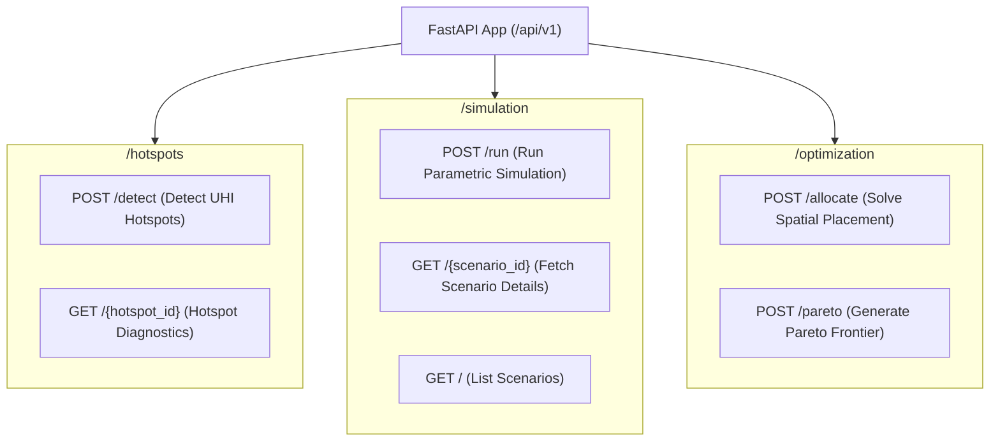

# FastAPI Route Controllers (`src/aerocool_ai/backend_api/routes/`)

This directory contains the FastAPI endpoint route handlers partitioned by domain responsibility.

---

## Endpoint Summary



---

## Files in this Directory

### 1. [`__init__.py`](file:///C:/Users/mayan/Development/Projects/AeroCool-AI/src/aerocool_ai/backend_api/routes/__init__.py)
- **Role**: Exports route routers: `hotspots_router`, `simulation_router`, `optimization_router`.

---

### 2. [`hotspots.py`](file:///C:/Users/mayan/Development/Projects/AeroCool-AI/src/aerocool_ai/backend_api/routes/hotspots.py)
- **Prefix**: `/api/v1/hotspots`
- **Endpoints**:
  - `POST /detect`:
    - **Summary**: Ingests Landsat/ECOSTRESS LST, Sentinel-2 reflectance, and OSM 3D morphology over the input `bbox`.
    - **Logic**: Extracts biophysical features (albedo, FVC, SVF, building density), computes regional thermal anomalies $\Delta T = \text{LST} - \overline{\text{LST}}$, identifies dominant heating drivers, and returns a standard RFC 7946 GeoJSON `HotspotFeatureCollection`.
    - **Response**: `200 OK` -> `HotspotFeatureCollection`.
  - `GET /{hotspot_id}`:
    - **Summary**: Retrieves detailed thermodynamic diagnostics and prioritized mitigation feasibility for a specific hotspot.
    - **Response**: `200 OK` -> JSON diagnostic profile.

---

### 3. [`simulation.py`](file:///C:/Users/mayan/Development/Projects/AeroCool-AI/src/aerocool_ai/backend_api/routes/simulation.py)
- **Prefix**: `/api/v1/simulation`
- **Endpoints**:
  - `POST /run`:
    - **Summary**: Executes a parametric urban cooling simulation for an intervention strategy (`green_roof`, `cool_roof`, `urban_canopy`, `cool_pavement`).
    - **Logic**: Modifies surface properties, calculates temperature drops via the thermodynamic simulator, evaluates building HVAC energy and carbon savings, and persists the scenario and results into PostGIS tables.
    - **Response**: `201 Created` -> `SimulationRunResponse`.
  - `GET /{scenario_id}`:
    - **Summary**: Retrieves full scenario metadata, status, and computed impact records from the database.
    - **Response**: `200 OK` -> Scenario details JSON.
  - `GET /`:
    - **Summary**: Lists historical simulation scenarios with pagination (`limit`, `offset`) and status filtering.
    - **Response**: `200 OK` -> List of `ScenarioItemResponse`.

---

### 4. [`optimization.py`](file:///C:/Users/mayan/Development/Projects/AeroCool-AI/src/aerocool_ai/backend_api/routes/optimization.py)
- **Prefix**: `/api/v1/optimization`
- **Endpoints**:
  - `POST /allocate`:
    - **Summary**: Solves the budget-constrained spatial allocation solver across multiple cooling intervention strategies.
    - **Logic**: Evaluates marginal return on investment ($\text{ROI} = \frac{\Delta T \times \text{HVI} \times \text{Area}}{\text{Cost}}$) per parcel and returns prioritized parcel assignments with full GeoJSON mapping.
    - **Response**: `200 OK` -> `OptimizationAllocationResponse`.
  - `POST /pareto`:
    - **Summary**: Generates a multi-budget Pareto efficiency frontier mapping capital expenditure to temperature reductions, identifying the recommended investment inflection point.
    - **Response**: `200 OK` -> `ParetoFrontierResponse`.

---

## Example cURL Requests

```bash
# Detect Hotspots
curl -X POST http://localhost:8000/api/v1/hotspots/detect \
  -H "Content-Type: application/json" \
  -d '{
    "bbox": [-74.02, 40.70, -73.95, 40.78],
    "start_date": "2026-06-01",
    "end_date": "2026-08-31",
    "min_temp_anomaly_celsius": 2.5
  }'

# Run Optimization Allocation
curl -X POST http://localhost:8000/api/v1/optimization/allocate \
  -H "Content-Type: application/json" \
  -d '{
    "bbox": [-74.02, 40.70, -73.95, 40.78],
    "budget_usd": 300000.0,
    "allowed_strategies": ["cool_roof", "green_roof", "urban_canopy"]
  }'
```
