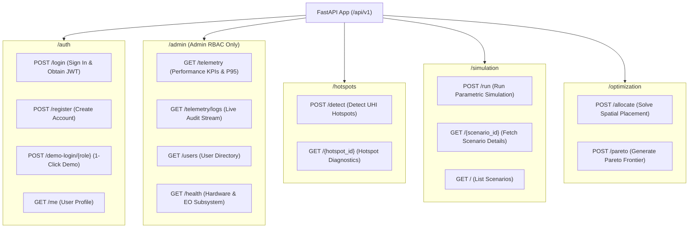

# FastAPI Route Controllers (`src/aerocool_ai/backend_api/routes/`)

This directory contains the FastAPI endpoint route handlers partitioned by domain responsibility.

---

## Endpoint Summary

---

## Files in this Directory

### 1. [`__init__.py`](file:///C:/Users/mayan/Development/Projects/AeroCool-AI/src/aerocool_ai/backend_api/routes/__init__.py)
- **Role**: Exports route routers: `auth_router`, `admin_router`, `hotspots_router`, `simulation_router`, `optimization_router`.

---

### 2. [`auth.py`](file:///C:/Users/mayan/Development/Projects/AeroCool-AI/src/aerocool_ai/backend_api/routes/auth.py)
- **Prefix**: `/api/v1/auth`
- **Endpoints**:
  - `POST /login`: Authenticates email and password against PBKDF2 hash, returning signed JWT bearer token.
  - `POST /register`: Creates a new municipal planner or administrator account.
  - `POST /demo-login/{role}`: 1-click token generator for `admin` or `customer`.
  - `GET /me`: Returns the authenticated user's profile and permissions.

---

### 3. [`admin.py`](file:///C:/Users/mayan/Development/Projects/AeroCool-AI/src/aerocool_ai/backend_api/routes/admin.py)
- **Prefix**: `/api/v1/admin` *(Protected by `require_admin` dependency)*
- **Endpoints**:
  - `GET /telemetry`: Aggregated server KPIs (P95 latency, average latency, cache efficiency %, status code counts).
  - `GET /telemetry/logs`: Streaming live API request audit log.
  - `GET /users`: Lists all registered municipal users with pagination.
  - `GET /health`: Hardware diagnostics (PyTorch device accelerator, CPU %, RSS memory MB, and Earth Observation providers).

---

### 4. [`hotspots.py`](file:///C:/Users/mayan/Development/Projects/AeroCool-AI/src/aerocool_ai/backend_api/routes/hotspots.py)
- **Prefix**: `/api/v1/hotspots`
- **Endpoints**:
  - `POST /detect`: Ingests Landsat/ECOSTRESS LST, Sentinel-2 reflectance, and OSM 3D morphology over the input `bbox`, returning RFC 7946 GeoJSON.
  - `GET /{hotspot_id}`: Retrieves detailed thermodynamic diagnostics and prioritized mitigation feasibility for a specific hotspot.

---

### 5. [`simulation.py`](file:///C:/Users/mayan/Development/Projects/AeroCool-AI/src/aerocool_ai/backend_api/routes/simulation.py)
- **Prefix**: `/api/v1/simulation`
- **Endpoints**:
  - `POST /run`: Executes parametric urban cooling simulation, evaluates HVAC and carbon savings, and persists results.
  - `GET /{scenario_id}`: Retrieves full scenario metadata, status, and computed impact records from the database.
  - `GET /`: Lists historical simulation scenarios with pagination.

---

### 6. [`optimization.py`](file:///C:/Users/mayan/Development/Projects/AeroCool-AI/src/aerocool_ai/backend_api/routes/optimization.py)
- **Prefix**: `/api/v1/optimization`
- **Endpoints**:
  - `POST /allocate`: Solves budget-constrained spatial allocation solver across multiple cooling intervention strategies.
  - `POST /pareto`: Generates a multi-budget Pareto efficiency frontier mapping capital expenditure to temperature reductions.
