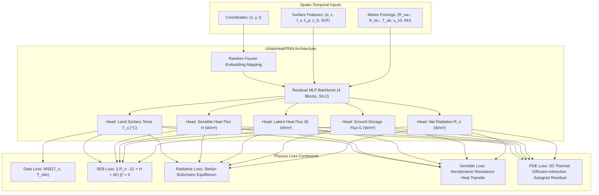

# Physics-Informed Machine Learning & Regressors (`src/aerocool_ai/core_engine/models/`)

The `models` submodule contains empirical machine learning benchmarks and the core **Physics-Informed Neural Network (PINN)** that enforces conservation laws across urban microclimates.

---

## Architectural Principles

Standard black-box neural networks often predict physically impossible surface temperatures (e.g., negative heat fluxes or violations of energy conservation). AeroCool-AI uses a **Physics-Informed Neural Network (PINN)** that incorporates first-principles thermodynamic constraints directly into the loss function.



---

## Files in this Directory

### 1. [`__init__.py`](file:///C:/Users/mayan/Development/Projects/AeroCool-AI/src/aerocool_ai/core_engine/models/__init__.py)
- **Role**: Exports public classes: `LSTBaselineRegressor`, `UrbanHeatPINN`, `SurfaceEnergyBalanceLoss`, `PINNCompositeLoss`, `PINNTrainingPipeline`.

---

### 2. [`baseline_regressor.py`](file:///C:/Users/mayan/Development/Projects/AeroCool-AI/src/aerocool_ai/core_engine/models/baseline_regressor.py)
- **Role**: High-performance empirical gradient boosted trees (XGBoost) and Random Forest regressors for feature importance ranking and baseline comparisons.
- **Key Classes**:
  - `BaselineEvaluationMetrics`: RMSE, MAE, $R^2$, feature importances dictionary.
  - `LSTBaselineRegressor`:
    - `fit(X, y)`: Trains regressor on multi-variate feature matrix.
    - `predict(X)`: Batch prediction of LST (°C).
    - `evaluate(X, y)`: Calculates error metrics and feature importance gains.
    - `predict_spatial_grid(feature_maps)`: Full 2D raster grid inference.
- **Usage Example**:
  ```python
  from aerocool_ai.core_engine.models.baseline_regressor import LSTBaselineRegressor

  regressor = LSTBaselineRegressor(model_type="xgboost", n_estimators=100)
  regressor.fit(X_train, y_train)
  metrics = regressor.evaluate(X_test, y_test)
  print(f"Baseline Test RMSE: {metrics.rmse:.2f} °C, R²: {metrics.r2:.3f}")
  ```

---

### 3. [`pinn_heat_dynamics.py`](file:///C:/Users/mayan/Development/Projects/AeroCool-AI/src/aerocool_ai/core_engine/models/pinn_heat_dynamics.py)
- **Role**: PyTorch Physics-Informed Neural Network for urban thermal modeling.
- **Key Classes & Methods**:
  - `FourierFeatureMapping`: Overcomes spectral bias and enables high-frequency spatial learning:
    $$\gamma(\mathbf{x}) = [\sin(2\pi \mathbf{B}\mathbf{x}), \cos(2\pi \mathbf{B}\mathbf{x})]$$
  - `UrbanHeatPINN`:
    - Multi-head outputs for $T_s$, $H$, $\lambda E$, $G$, and $R_n$.
    - `get_optimal_device()`: Automatically detects and selects optimal execution accelerator (`cuda` -> `mps` -> `cpu`).
    - `predict_grid_accelerated(coords, surface, meteo, device)`: Accelerated 2D raster tensor inference with `@torch.inference_mode()`.
    - `compute_spatial_temporal_derivatives(t_s, coords)`: Computes exact PyTorch autograd partial derivatives:
      $$\frac{\partial T_s}{\partial x}, \quad \frac{\partial T_s}{\partial y}, \quad \frac{\partial T_s}{\partial t}, \quad \nabla^2 T_s = \frac{\partial^2 T_s}{\partial x^2} + \frac{\partial^2 T_s}{\partial y^2}$$
- **Usage Example**:
  ```python
  import torch
  from aerocool_ai.core_engine.models.pinn_heat_dynamics import UrbanHeatPINN

  device = UrbanHeatPINN.get_optimal_device()
  model = UrbanHeatPINN().to(device)
  coords = torch.randn(16, 3, requires_grad=True, device=device)  # (x, y, t)
  surface = torch.rand(16, 6, device=device)
  meteo = torch.rand(16, 5, device=device)

  out = model(coords, surface, meteo)
  dt_dx, dt_dy, dt_dt, laplacian = model.compute_spatial_temporal_derivatives(out.t_s, coords)
  ```

---

### 4. [`loss_functions.py`](file:///C:/Users/mayan/Development/Projects/AeroCool-AI/src/aerocool_ai/core_engine/models/loss_functions.py)
- **Role**: Encodes physical thermodynamic laws and residual penalties.
- **Key Classes & Formulations**:
  - `SurfaceEnergyBalanceLoss`:
    1. **Energy Balance Residual**: $\mathcal{L}_{\text{SEB}} = \| R_n - (G + H + \lambda E) \|^2$
    2. **Stefan-Boltzmann Net Radiation**:
       $$R_{n,\text{phys}} = (1 - \alpha) R_{sw\downarrow} + \varepsilon R_{lw\downarrow} - \varepsilon \sigma (T_s + 273.15)^4$$
    3. **Bulk Aerodynamic Resistance ($r_a$) & Sensible Heat Flux**:
       $$r_a = \frac{\ln(z / z_0)^2}{\kappa^2 u_{10}}, \quad H_{\text{phys}} = \rho_{\text{air}} c_p \frac{T_s - T_{\text{air}}}{r_a}$$
    4. **Spatiotemporal 2D PDE Residual**:
       $$\mathcal{R}_{\text{PDE}} = \frac{\partial T_s}{\partial t} - D \nabla^2 T_s - \frac{R_n - G - H - \lambda E}{\rho C_{\text{eff}}}$$
  - `PINNCompositeLoss`: Computes total weighted loss:
    $$\mathcal{L}_{\text{total}} = w_{\text{data}} \mathcal{L}_{\text{MSE}} + w_{\text{physics}} \mathcal{L}_{\text{Physics}}$$

---

### 5. [`train_pipeline.py`](file:///C:/Users/mayan/Development/Projects/AeroCool-AI/src/aerocool_ai/core_engine/models/train_pipeline.py)
- **Role**: End-to-end training management, learning rate scheduling, validation metrics, and model checkpointing.
- **Key Classes**:
  - `TrainingHistory`: Epoch histories for train loss, validation loss, RMSE, MAE, and SEB energy imbalance ($\text{W/m}^2$).
  - `PINNTrainingPipeline`:
    - `train_epoch(dataloader, compute_pde_derivatives)`: Single epoch training step.
    - `evaluate(dataloader)`: Validation evaluation.
    - `fit(train_loader, val_loader, epochs, checkpoint_name)`: Full training loop.
    - `save_checkpoint(path)` / `load_checkpoint(path)`.
- **Usage Example**:
  ```python
  from aerocool_ai.core_engine.models.train_pipeline import PINNTrainingPipeline

  pipeline = PINNTrainingPipeline(device="cpu")
  history = pipeline.fit(train_loader, val_loader, epochs=50)
  print(f"Best Epoch: {history.best_epoch} | Best Val RMSE: {history.best_val_rmse:.2f} °C")
  ```
