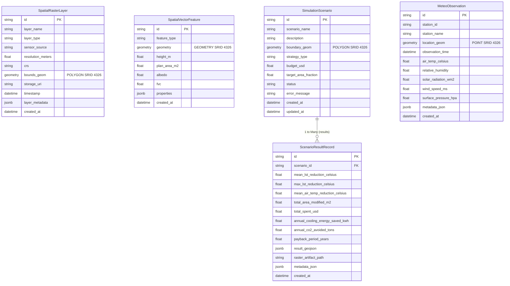

# PostGIS SQLAlchemy Declarative Models (`src/aerocool_ai/database/models/`)

This directory contains GeoAlchemy2 and SQLAlchemy 2.0 declarative database models representing spatial layers, simulation runs, impact results, and in-situ meteorological observations.

---

## Entity Relationship (ER) Diagram

---

## Files in this Directory

### 1. [`__init__.py`](file:///C:/Users/mayan/Development/Projects/AeroCool-AI/src/aerocool_ai/database/models/__init__.py)
- **Role**: Exports ORM model entities.
- **Exports**: `SpatialRasterLayer`, `SpatialVectorFeature`, `SimulationScenario`, `ScenarioResultRecord`, `MeteoObservation`.

---

### 2. [`spatial_layers.py`](file:///C:/Users/mayan/Development/Projects/AeroCool-AI/src/aerocool_ai/database/models/spatial_layers.py)
- **Role**: Spatial raster catalog and vector feature tables.
- **Models**:
  - `SpatialRasterLayer`: Stores raster metadata, bounding polygons (`Geometry('POLYGON', srid=4326)`), resolution, timestamp, and cloud storage URIs.
    - Composite index on `(layer_type, timestamp)`.
  - `SpatialVectorFeature`: Stores vector geometries (building footprints, street polygons, land parcels) with biophysical attributes (`height_m`, `albedo`, `fvc`, `plan_area_m2`).

---

### 3. [`scenario_results.py`](file:///C:/Users/mayan/Development/Projects/AeroCool-AI/src/aerocool_ai/database/models/scenario_results.py)
- **Role**: Simulation configuration and computed impact logs.
- **Models**:
  - `SimulationScenario`: Represents an urban cooling simulation run with user-defined target bounding polygon (`Geometry('POLYGON', srid=4326)`), strategy type, budget, and lifecycle status (`pending`, `running`, `completed`, `failed`).
  - `ScenarioResultRecord`: Stores computed thermodynamic outputs ($\Delta T_{\text{LST}}$, $\Delta T_{\text{air}}$), annual energy savings ($\text{kWh}$), avoided $\text{CO}_2$ emissions, and full RFC 7946 GeoJSON allocations.

---

### 4. [`sensor_meteo.py`](file:///C:/Users/mayan/Development/Projects/AeroCool-AI/src/aerocool_ai/database/models/sensor_meteo.py)
- **Role**: In-situ weather station logs for PINN model assimilation.
- **Models**:
  - `MeteoObservation`: Stores sensor spatial coordinates (`Geometry('POINT', srid=4326)`), observation time, air temperature, solar flux, wind speed, relative humidity, and barometric pressure.
  - Composite index on `(station_id, observation_time)`.
