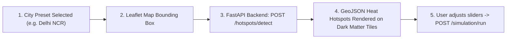

# AeroCool-AI Frontend Subsystem (`src/aerocool_ai/frontend/`)

This directory contains the production web client for **AeroCool-AI**, built with **React 19 + TypeScript + Vite + Tailwind CSS + Leaflet**.

---

## 🌟 Quick Primer for Juniors: How the Frontend Works

If you are a junior frontend or full-stack developer joining the project, here is how the application is organized:

### 1. Data Flow in 4 Steps


1. **City Selection**: The user picks an Indian city preset from the header (e.g., *Delhi NCR*, *Mumbai BKC*, *Bengaluru*), which centers the Leaflet map and computes the target bounding box `bbox`.
2. **Hotspot Detection**: The app queries `/api/v1/hotspots/detect`. The backend downloads Landsat/Sentinel satellite data in real-time, runs thermodynamic feature extraction, and returns a standard RFC 7946 GeoJSON `FeatureCollection`.
3. **Interactive Map**: Leaflet renders hotspot parcels color-coded by temperature anomaly (yellow $\sim 2^\circ\text{C}$ up to deep red $\sim 8^\circ\text{C}$). Clicking any hotspot opens a diagnostic card.
4. **Parametric Simulation**: The user tests cooling strategies (*Green Roofs*, *Cool Roofs*, *Urban Canopies*) with interactive sliders. The simulation calculates avoided HVAC kilowatt-hours, carbon emissions avoided, and financial payback in seconds.

### 2. State Management & Authentication Architecture
- `<AuthProvider>`: Wraps `<App />` at the root (`main.tsx`). It manages the active JWT bearer token in browser `localStorage`, tracks the user's role (`customer` vs `admin`), and injects authorization headers automatically.
- **1-Click Demo Switcher**: Click the user profile icon in the top right to switch between **Planner** (`planner@aerocool.ai`) and **Admin** (`admin@aerocool.ai`) with a single click.

---

## Tech Stack & Architecture

| Framework / Tool | Version / Purpose |
|---|---|
| **React 19 + TypeScript** | Strongly typed, reactive component architecture with sub-millisecond re-renders |
| **Vite 6** | Fast HMR dev server and production bundler with Rollup vendor chunk splitting |
| **Tailwind CSS 3** | Glassmorphic dark theme (`#0B0F17`), responsive cards, and print styles |
| **Leaflet & React-Leaflet 5** | High-performance interactive geospatial mapping (Dark Matter, Positron, Esri Satellite) |
| **Recharts** | Interactive SVG Pareto efficiency curves and multi-budget frontier visualization |
| **Lucide Icons** | Clean, accessible vector UI icons |

---

## Directory Layout

```text
src/aerocool_ai/frontend/
├── package.json              # NPM dependencies & scripts
├── vite.config.ts            # Vite bundler, API proxy & Rollup manualChunks config
├── tsconfig.json             # TypeScript compiler configuration
├── tsconfig.node.json        # Vite TypeScript node configuration
├── tailwind.config.js        # Custom Tailwind palette and typography
├── postcss.config.js         # PostCSS plugins
├── index.html                # HTML5 entrypoint with Inter font
├── README.md                 # Documentation (this file)
├── dist/                     # Pre-compiled production React SPA bundle
└── src/                      # React TypeScript source code
    ├── main.tsx              # React DOM root mounting
    ├── App.tsx               # Root application shell, state management & print triggers
    ├── index.css             # Tailwind base styles & glassmorphic utilities
    ├── context/              # Authentication & user state context
    │   └── AuthContext.tsx   # JWT session storage, login/logout, and demo profile switcher
    ├── types/                # TypeScript interfaces (Hotspots, Simulations, Pareto, Auth, Telemetry)
    │   └── index.ts
    ├── services/             # API client service for FastAPI backend
    │   └── api.ts
    └── components/           # Modular React components
        ├── Header.tsx        # Glassmorphic header, status badge, city preset, role switcher & auth modal triggers
        ├── MetricCards.tsx   # Top KPI metrics (Baseline LST, Peak Temp, Hotspot Area)
        ├── HotspotMap.tsx    # Leaflet map with dark/satellite tiles, layer switcher & popups
        ├── SimulationPanel.tsx # Parametric cooling intervention sliders & thermodynamic KPIs
        ├── ScenarioComparison.tsx # Head-to-head A/B microclimate policy comparison
        ├── ParetoChart.tsx   # Recharts Pareto investment efficiency frontier
        ├── PhysicsPanel.tsx  # Surface Energy Balance & PINN explainers
        ├── LoginModal.tsx    # Glassmorphic modal with 1-click instant demo profiles & sign-in forms
        └── AdminDashboard.tsx # Real-time API telemetry gauges, audit log stream & user directory
```

---

## Key Features

1. **Role-Based Portals (Customer vs Admin)**:
   - 🏛️ **Customer / Climate Planner**: Geospatial UHI maps, parametric simulations, Pareto curves, and printable Heat Action Plans.
   - 👑 **Administrator**: Full access to planning tools **plus** live telemetry KPIs (P95 latency, requests/sec, cache efficiency), streaming API audit inspector, and user account directory.
2. **1-Click Instant Demo Login**: Switch between `Admin User` and `Customer User` instantly with zero friction.
3. **Indian City Presets & Regional Profiles**: Instant geospatial bounding boxes and climate zone diagnostics for Delhi NCR, Noida, Mumbai BKC, Nagpur, Bengaluru, and Ahmedabad.
4. **Dual Currency Toggle (₹ INR / $ USD)**: Live conversion (1 USD = ₹83.5 INR) formatted in Lakhs/Crores for municipal budget planners.
5. **Head-to-Head A/B Scenario Comparison**: Evaluate two cooling strategies (e.g. *Cool Roofs* vs *Urban Tree Canopies*) at equivalent capital expenditure with detailed thermodynamic trade-offs.
6. **Printable Municipal Heat Action Plan**: One-click summary export formatted for municipal climate response reports.
7. **Code-Split Optimized Bundle**: Sub-245 kB initial JavaScript payload via Rollup manual chunks (`react-vendor`, `leaflet-vendor`, `recharts-vendor`, `lucide-vendor`).

---

## How to Run the Frontend

### Option 1: React 19 Development Server (Port 3000)
```bash
# Navigate to frontend directory
cd src/aerocool_ai/frontend

# Install dependencies (if needed)
npm.cmd install

# Start Vite dev server with Hot Module Reloading (HMR)
npm.cmd run dev
```
- Open in browser: **[http://localhost:3000](http://localhost:3000)**

---

### Option 2: Unified Full-Stack via FastAPI (Port 8000)
```bash
# Build production bundle
cd src/aerocool_ai/frontend && npm.cmd run build

# Start FastAPI server (serves the React SPA at /dashboard)
uv run uvicorn aerocool_ai.backend_api.main:app --host 0.0.0.0 --port 8000 --reload
```
- Open in browser: **[http://localhost:8000/dashboard](http://localhost:8000/dashboard)**
